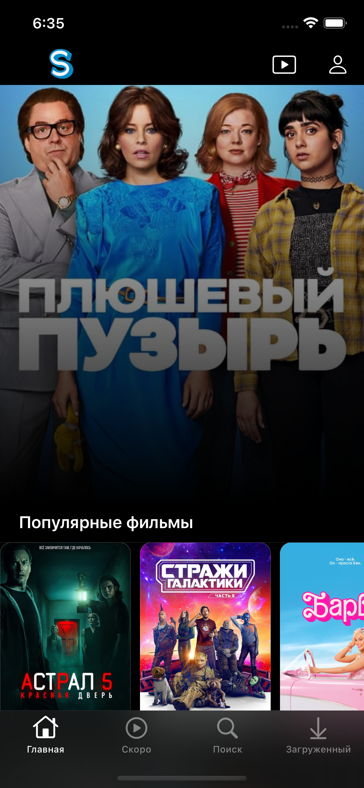

# Shurup

Shurup это приложение в котором можно посмотреть фильмы.

## Стек

Данное приложение написано на Swift 

На архитектуре MVC
```swift
import UIKit
import Snapkit
import Firebase
import SDWebImage
import Alamofire
import CoreData

```
## Скрины приложения
 
  
 
